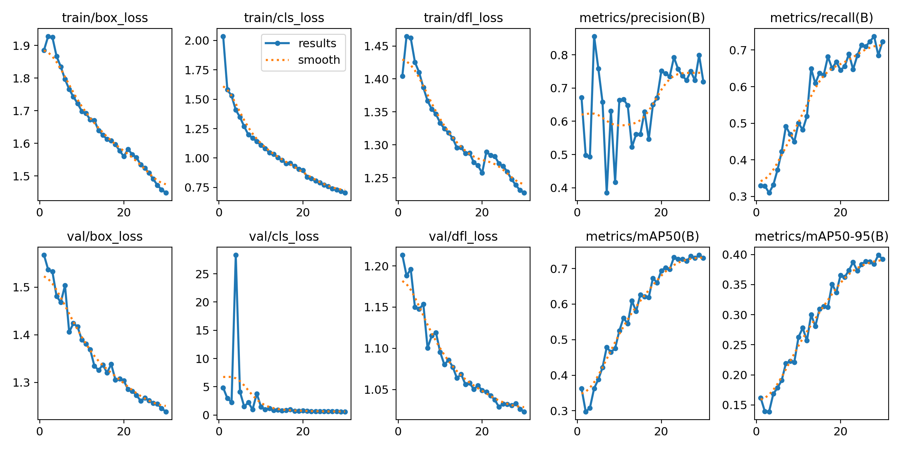
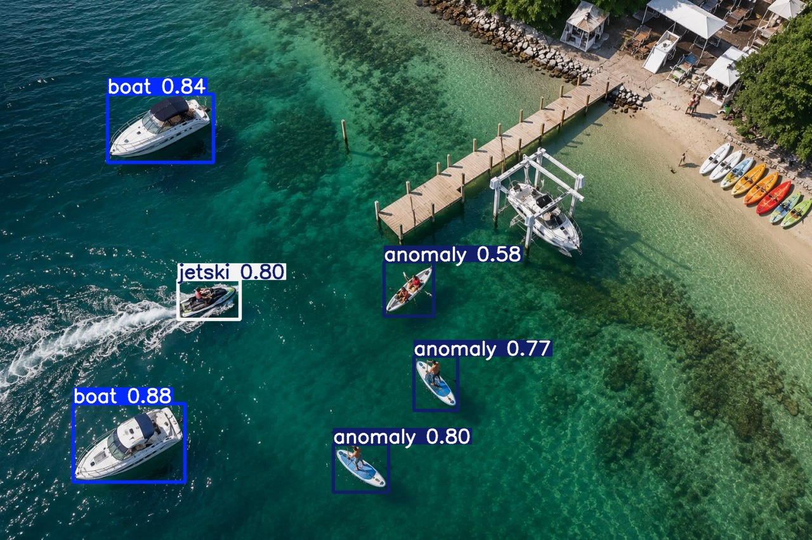

# 🚢 UAV-Based Maritime Surveillance and Anomaly Detection System

A Computer Vision project focused on maritime surveillance using **YOLOv12** for real-time vessel and anomaly detection from UAV (drone) imagery and videos.

---

## 📌 Project Overview

This project aims to enhance maritime surveillance by detecting and monitoring vessels and anomalous maritime objects from aerial drone footage.

The system is built using **YOLOv12** and trained on a custom maritime dataset created by combining multiple maritime datasets and performing extensive dataset engineering, annotation conversion, class remapping, and preprocessing.

---

## 🎯 Key Features

* Real-time maritime object detection using YOLOv12
* Detection of:

  * Boats
  * Jet Skis
  * Docks
  * Lifts
  * Maritime Anomalies (Windsurfers)
* Custom multi-dataset training pipeline
* UAV/drone-based aerial surveillance
* Large-scale dataset preprocessing and integration
* Real-time video inference and monitoring
* Extensible tracking and anomaly analysis pipeline

---

## 🛠️ Tech Stack

* Python
* YOLOv12 (Ultralytics)
* OpenCV
* Google Colab
* NumPy
* Computer Vision
* Object Detection

---

## 📂 Dataset Engineering

The training dataset was created by combining and refining multiple maritime datasets.

### Preprocessing Pipeline

* COCO → YOLO annotation conversion
* Dataset cleaning and validation
* Class filtering and remapping
* Removal of empty annotations
* Multi-dataset integration
* Label consistency verification
* Custom data.yaml generation

### Final Classes

| Class ID | Class Name           |
| -------- | -------------------- |
| 0        | Boat                 |
| 1        | Dock                 |
| 2        | Jet Ski              |
| 3        | Lift                 |
| 4        | Anomaly (Windsurfer) |

### Dataset Size

* 14,000+ Training Images
* 3,000+ Validation Images
* 17,000+ Total Images
* Thousands of annotated maritime objects

---

## 📈 Model Training

### Model

* YOLOv12s

### Training Configuration

* Transfer Learning using pretrained YOLOv12 weights
* Fine-tuning on custom maritime datasets
* Multi-class object detection
* High-resolution aerial imagery

### Evaluation Metrics

* Precision
* Recall
* mAP@50
* mAP@50-95
* Confusion Matrix Analysis

---

## 🔍 Applications

* Maritime Surveillance
* Coastal Monitoring
* Harbor Security
* UAV-Based Monitoring
* Vessel Tracking
* Anomaly Detection
* Smart Port Monitoring

---

## 🚧 Ongoing Work

Current development focuses on:

* Object Tracking (SORT / DeepSORT)
* Vessel Re-identification
* Video-Based Maritime Surveillance
* Tracking-by-Detection Pipeline
* Advanced Anomaly Detection
* Motion and Stillness Analysis

---

## 📷 Sample Results

### Training Performance

### Detection Output

---

## 📊 Future Improvements

- Fine-tune the OSNet-based re-identification model on a larger and more diverse maritime dataset.
- Improve cross-view vessel re-identification using viewpoint-invariant feature learning and metric-learning techniques.
- Integrate stronger multi-object tracking algorithms for enhanced long-term identity preservation.
- Optimize the end-to-end detection, tracking, and re-identification pipeline for real-time deployment.

---

## 👨‍💻 Author

**Somya Vijay**

Computer Vision | Deep Learning | YOLOv12 | OSNet | Multi-Object Tracking | UAV Maritime Surveillance
